### Jenkins Day 1 

1- install jenkins with docker image 
```bash
docker run -p 8081:8080 -d jenkins/jenkins:lts
```
2- Install role based authorization plugin 
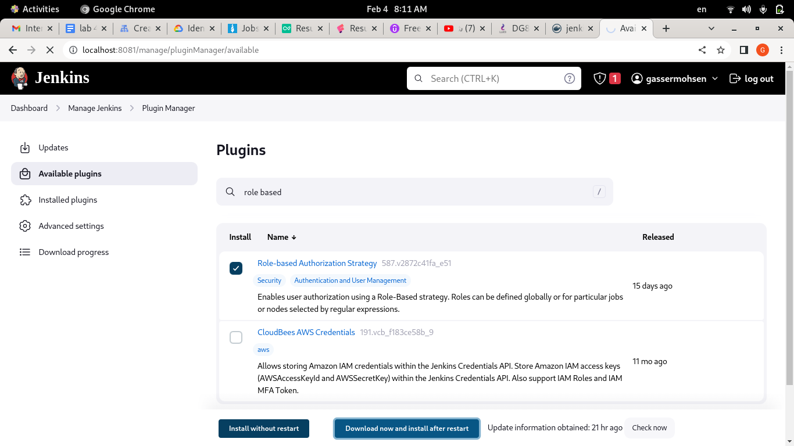

3- Create new user

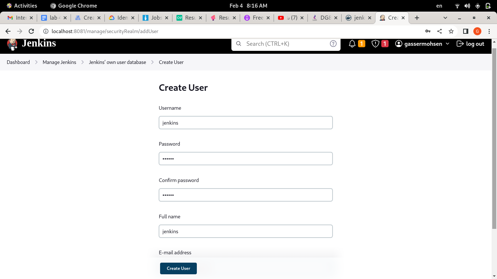

4- create read role and assign it to the new user

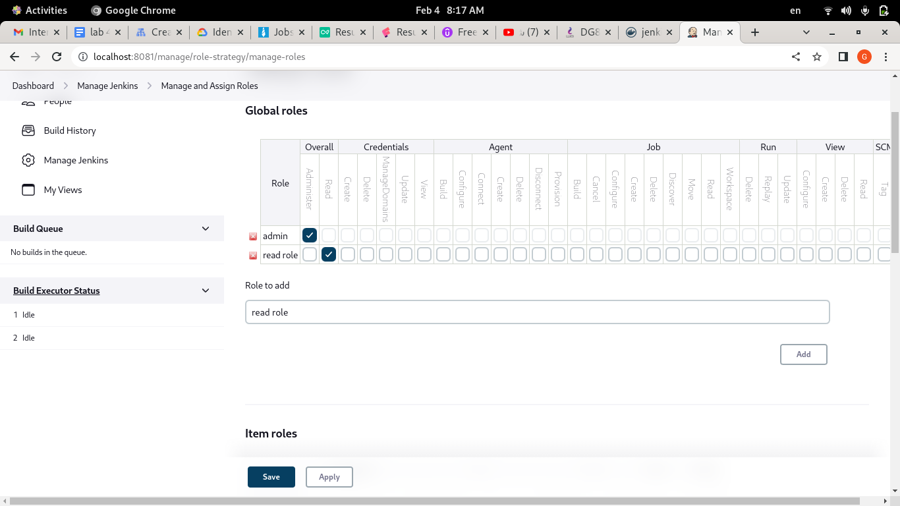
____

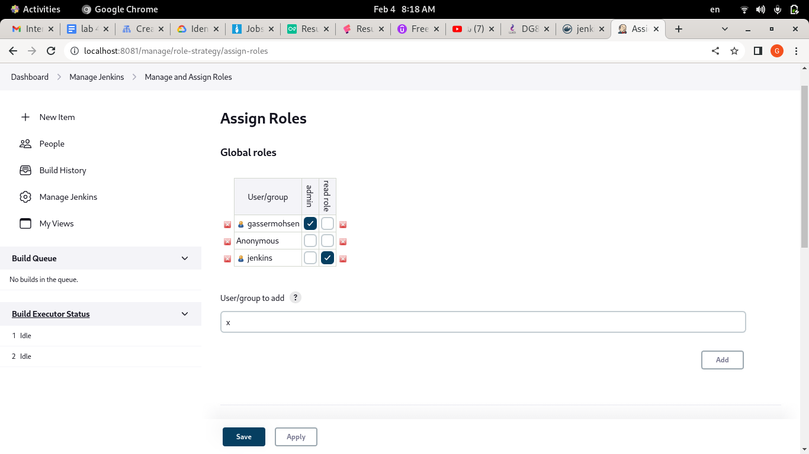

5-  create free style pipeline and link it to private git repo(inside it create directory and create file with "hello world") 

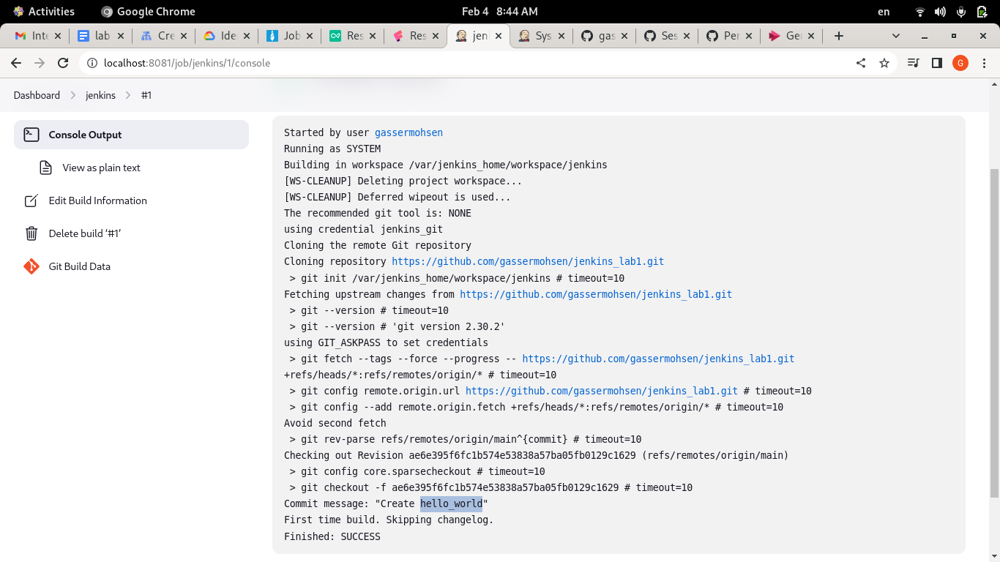

___
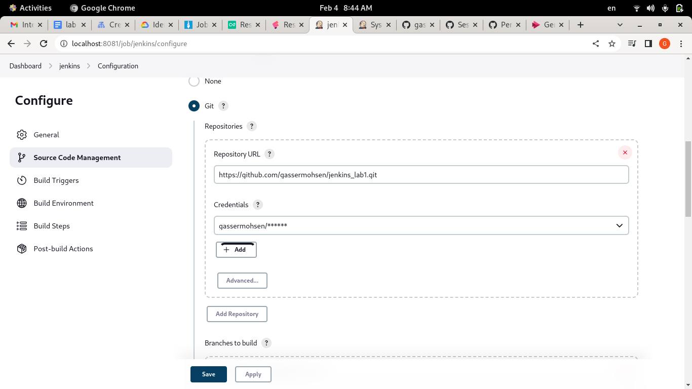

6- create declarative in jenkins GUI pipeline for your own repo to do "ls"

- First add the git credentials 
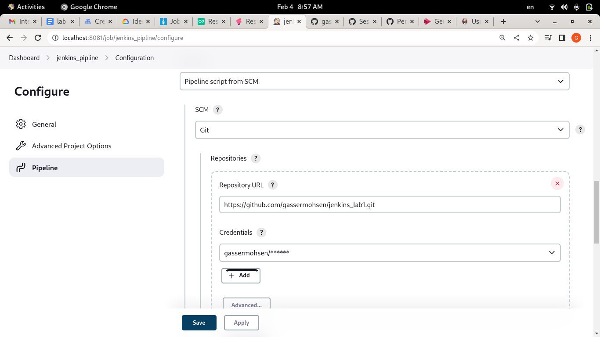

- Second add the jenkins file on github

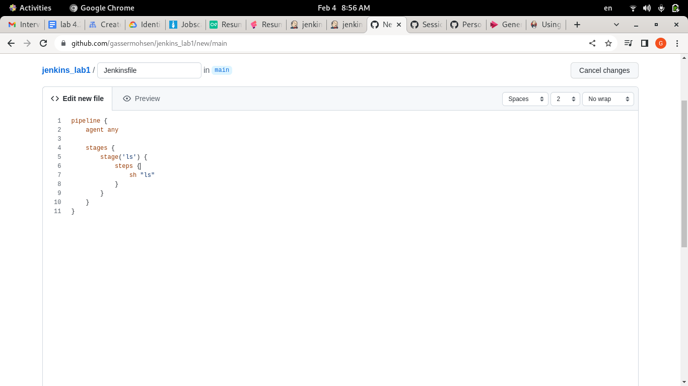

- Build results

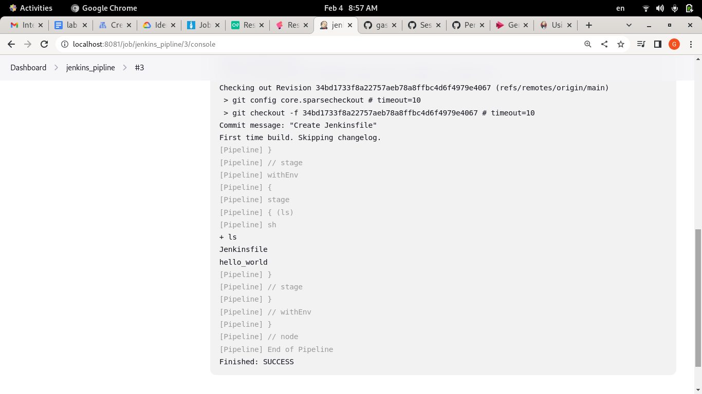

7-Create scripted in jenkins GUI pipeline for your own repo to do "ls"

- Scripted Code 
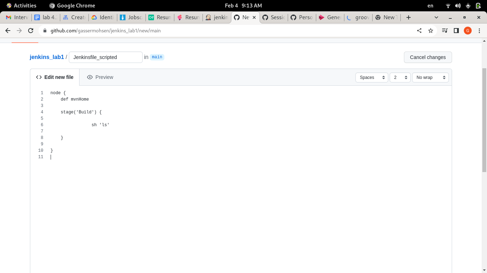

8- Create the same with jenkinsfile in your branches as multibranch pipeline

- Scan repository Log
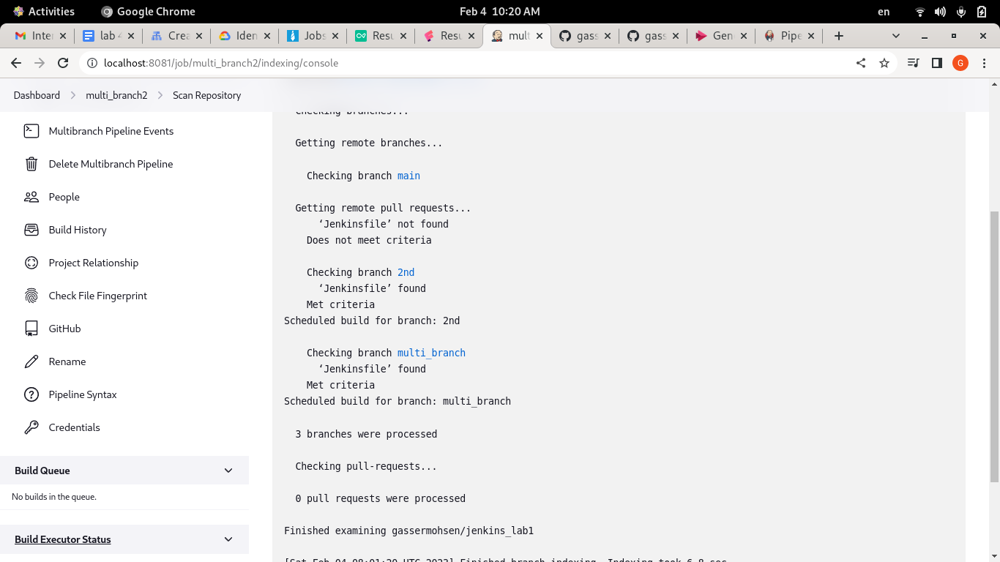

- All Branches With jenkins file

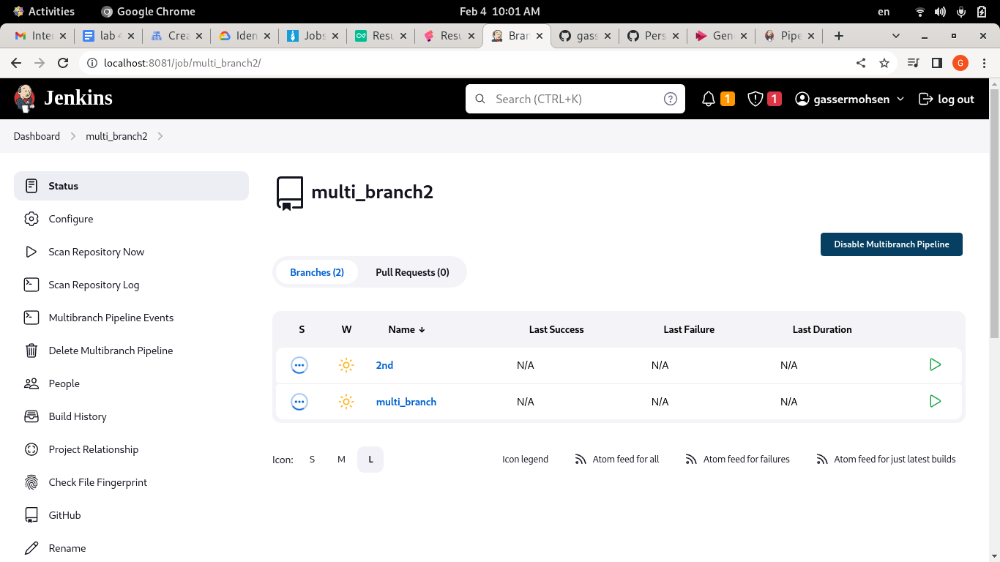


